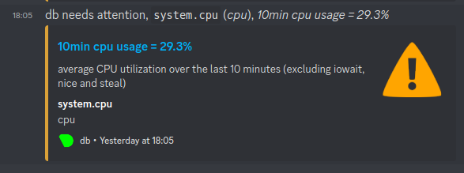

# Module 4 : Monitoring

Dans ce sujet on va installer un outil plutôt clé en main pour mettre en place un monitoring simple de nos machines.

L'outil qu'on va utiliser est [Netdata](https://learn.netdata.cloud/docs/agent/packaging/installer/methods/kickstart).

🌞 **Installer Netdata**

```
[user1@db ~]$ wget -O /tmp/netdata-kickstart.sh https://my-netdata.io/kickstart.sh && sh /tmp/netdata-kickstart.sh 
[user1@db ~]$ sudo systemctl start netdata
[user1@db ~]$ sudo systemctl enable netdata
[user1@db ~]$ sudo firewall-cmd --permanent --add-port=19999/tcp
success
[user1@db ~]$ sudo firewall-cmd --reload
success
[user1@db ~]$ sudo ss -ltunp | grep netdata
udp   UNCONN 0      0          127.0.0.1:8125       0.0.0.0:*    users:(("netdata",pid=3296,fd=47))
udp   UNCONN 0      0              [::1]:8125          [::]:*    users:(("netdata",pid=3296,fd=46))
tcp   LISTEN 0      4096       127.0.0.1:8125       0.0.0.0:*    users:(("netdata",pid=3296,fd=49))
tcp   LISTEN 0      4096         0.0.0.0:19999      0.0.0.0:*    users:(("netdata",pid=3296,fd=6)) 
tcp   LISTEN 0      4096           [::1]:8125          [::]:*    users:(("netdata",pid=3296,fd=48))
tcp   LISTEN 0      4096            [::]:19999         [::]:*    users:(("netdata",pid=3296,fd=7)) 
```


🌞 **Une fois Netdata installé et fonctionnel, déterminer :**

```
[user1@db ~]$ ps -ef | grep netdata | head -n 5 | tail -n 1
netdata     3296       1  0 16:47 ?        00:00:03 /usr/sbin/netdata -P /run/netdata/netdata.pid -D

[user1@db ~]$ sudo ss -ltunp | grep netdata
udp   UNCONN 0      0          127.0.0.1:8125       0.0.0.0:*    users:(("netdata",pid=3296,fd=47))
udp   UNCONN 0      0              [::1]:8125          [::]:*    users:(("netdata",pid=3296,fd=46))
tcp   LISTEN 0      4096       127.0.0.1:8125       0.0.0.0:*    users:(("netdata",pid=3296,fd=49))
tcp   LISTEN 0      4096         0.0.0.0:19999      0.0.0.0:*    users:(("netdata",pid=3296,fd=6)) 
tcp   LISTEN 0      4096           [::1]:8125          [::]:*    users:(("netdata",pid=3296,fd=48))
tcp   LISTEN 0      4096            [::]:19999         [::]:*    users:(("netdata",pid=3296,fd=7)) 
```

➜ **Vous ne devez PAS utiliser le "Cloud Netdata"**


🌞 **Configurer Netdata pour qu'il vous envoie des alertes** 

```
[user1@db ~]$ cd /etc/netdata/
[user1@db ~]$ ./edit-config health_alarm_notify.conf

```
```
On met l'url du webhook discord dans le fichier health
```


🌞 **Vérifier que les alertes fonctionnent**

```
[user1@db netdata]$ sudo dnf install stress
[user1@db netdata]$ stress --cpu 1
stress: info: [5218] dispatching hogs: 1 cpu, 0 io, 0 vm, 0 hdd
```
```
[user1@db netdata]$ cat health.d/cpu.conf | head -n 19

# you can disable an alarm notification by setting the 'to' line to: silent

 template: 10min_cpu_usage
       on: system.cpu
    class: Utilization
     type: System
component: CPU
       os: linux
    hosts: *
   lookup: average -10m unaligned of user,system,softirq,irq,guest
    units: %
    every: 1min
     warn: $this > 10
     crit: $this > (($status == $CRITICAL) ? (85) : (95))
    delay: down 15m multiplier 1.5 max 1h
     info: average CPU utilization over the last 10 minutes (excluding iowait, nice and steal)
       to: sysadmin
```

